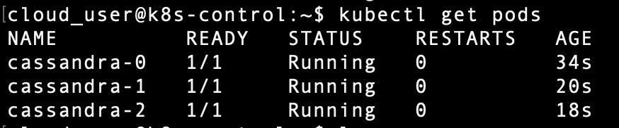

# Deploy a 3-pod Cassandra Ring as a statefulset to your Kubernetes Cluster using Persistent Volume

To deploy cassandra as statefulset we need to create storage class, persitent voulme and persitent volume claim.

### To deploy cassandra
1. $ kubectl create -f storage.yml
2. $ kubectl create -f host-pv.yml
3. $ kubectl create -f host-pvc.yml
4. $ kybectl create -f cassandra.yml

